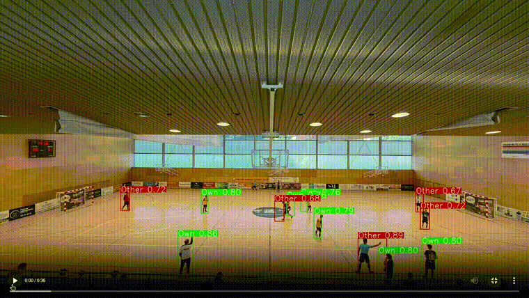
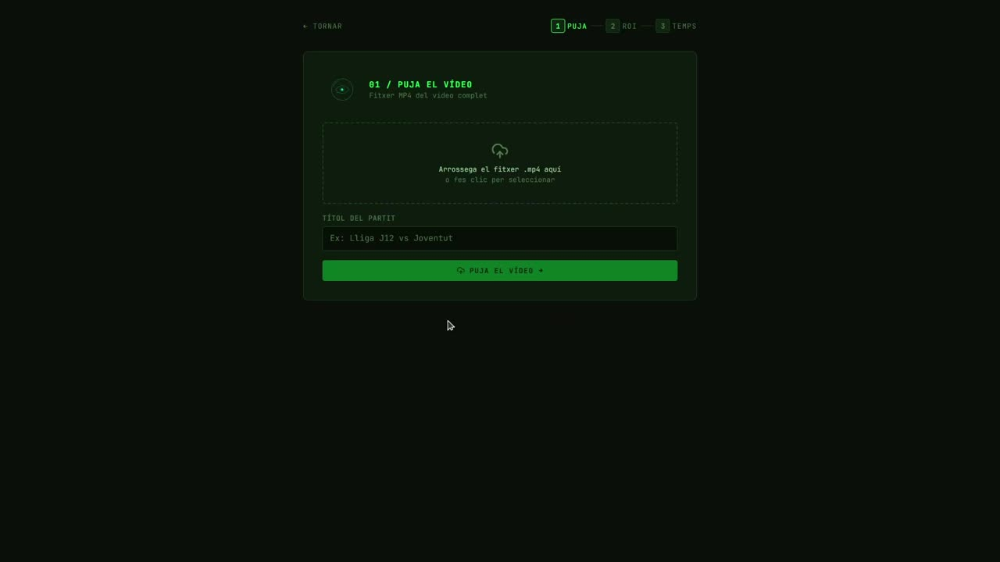
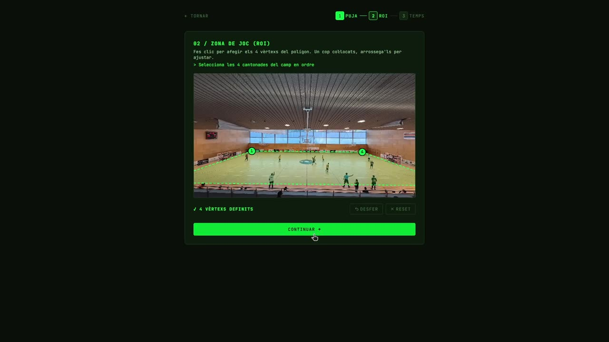
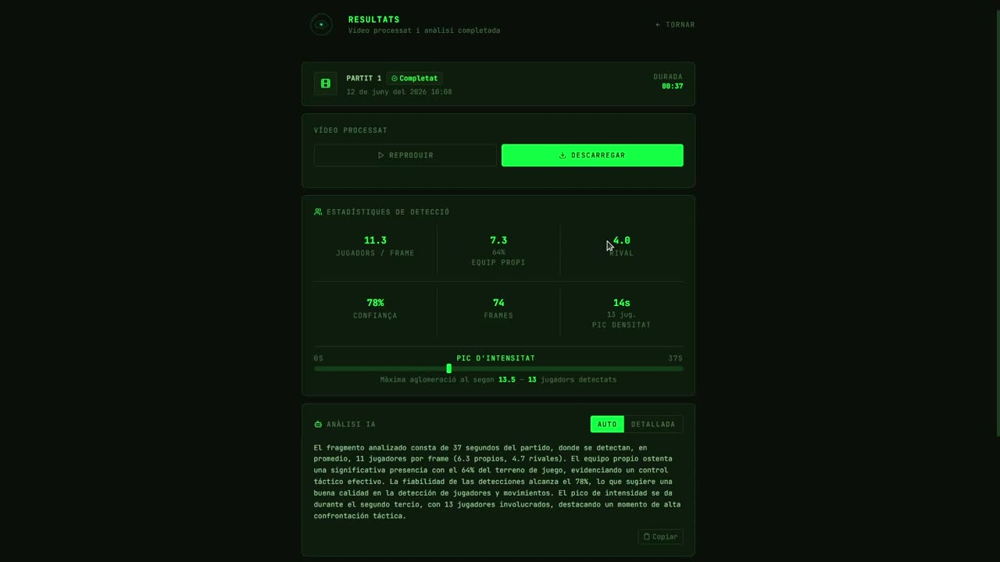
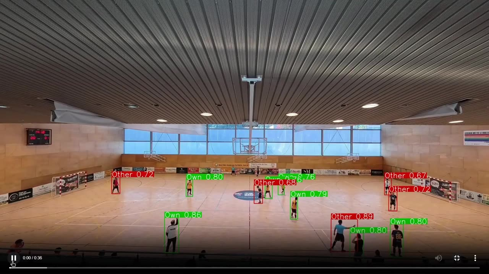
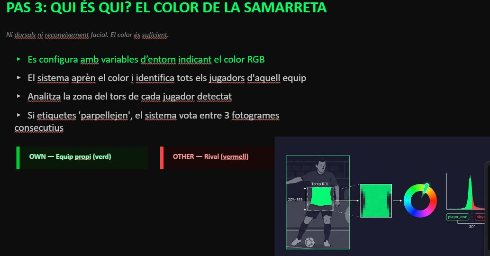
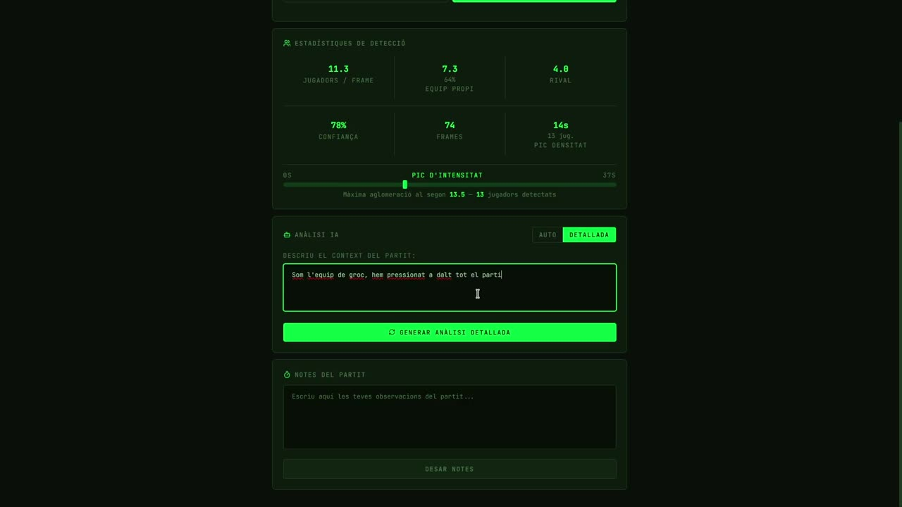
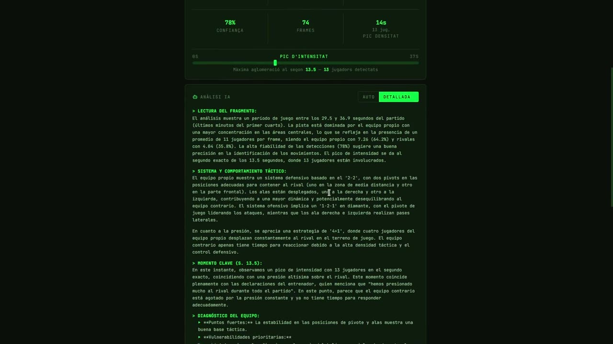
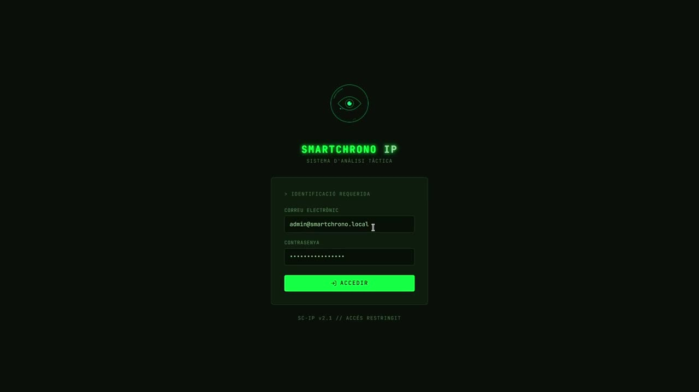
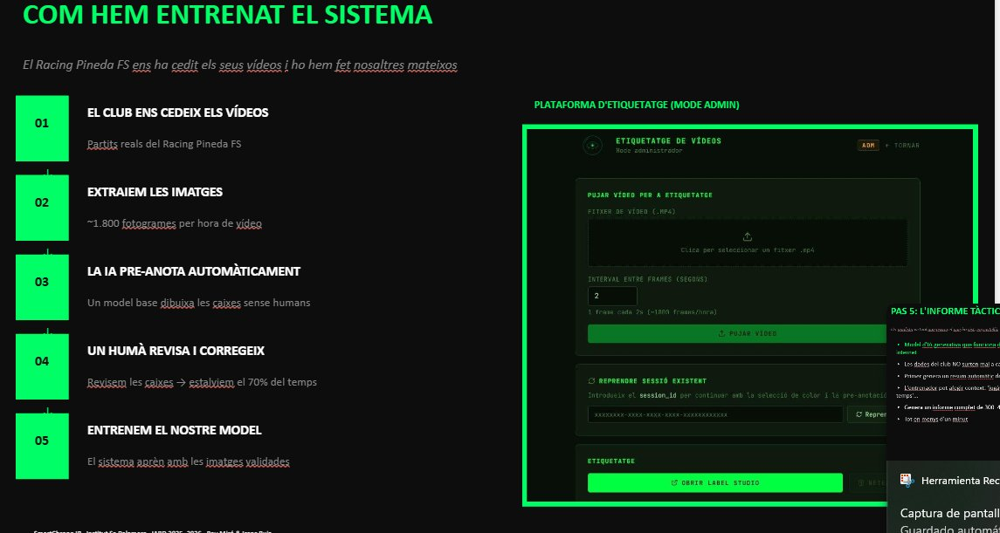

<div align="center">

# 🎥 SmartChrono IP

### Análisis táctico de fútbol sala mediante Visión por Computador e IA Generativa.
### 100% local · 100% privado · sin nube.

[](https://www.python.org/)
[](https://fastapi.tiangolo.com/)
[](https://react.dev/)
[](https://www.typescriptlang.org/)
[](https://www.docker.com/)
[](https://www.mongodb.com/)
[](https://redis.io/)
[](https://min.io/)
[](https://github.com/roboflow/rf-detr)
[](https://ollama.com/)

[Demo](#-demo-en-vídeo) · [Cómo funciona](#-cómo-funciona) · [Arquitectura](#%EF%B8%8F-arquitectura) · [Stack técnico](#-stack-técnico) · [Resultados](#-resultados) · [Autor](#-autor)

</div>

---

## 📌 ¿Qué es SmartChrono IP?

**SmartChrono IP** es un sistema de microservicios que convierte el vídeo de un partido de fútbol sala en un **análisis táctico automático**: detecta a los jugadores, identifica a qué equipo pertenece cada uno por el color de su camiseta, calcula estadísticas del partido y genera un informe táctico redactado por una IA generativa — **todo ejecutándose en local, sin depender de ningún servicio en la nube.**

Nace de un problema real: en clubs amateur como el **Racing Pineda FS**, el cuerpo técnico cronometra los minutos jugados de cada jugador con papel y bolígrafo durante el partido. SmartChrono IP automatiza por completo ese proceso y va un paso más allá, aportando contexto táctico que antes solo estaba al alcance de clubes profesionales con grandes presupuestos.

> Construido como **Proyecto Final** del Curso de Especialización en Inteligencia Artificial y Big Data (IABD) — Institut Sa Palomera, Blanes (2025-2026).

---

## 🎬 Demo en vídeo

<div align="center">


<sub>Detección de jugadores con RT-DETR + clasificación por color de camiseta sobre un partido real del Racing Pineda FS</sub>
</div>

<br>

📹 **Vídeo completo de la demo (análisis táctico end-to-end):** [`SmartChronoIP_DemoAnalisiTactic.mp4`](docs/demos/SmartChronoIP_DemoAnalisiTactic.mp4)
📹 **Vídeo de la demo de etiquetado de partidos:** `docs/demos/SmartChronoIP_DemoEtiquetatgePartits.mp4` *(añádelo a esta carpeta)*

---

## 🚀 Cómo funciona

La aplicación guía al entrenador en tres pasos simples — subir el vídeo, marcar la pista y esperar el análisis — sin que tenga que entender nada de lo que ocurre por debajo.

<table>
<tr>
<td width="33%" align="center"><b>1. Sube el partido</b></td>
<td width="33%" align="center"><b>2. Marca la pista (ROI)</b></td>
<td width="33%" align="center"><b>3. Resultados al instante</b></td>
</tr>
<tr>
<td></td>
<td></td>
<td></td>
</tr>
</table>

### El pipeline completo, fase a fase

```
   📤 Ingesta              🖼️ Extracción            🤖 Detección IA
  ┌──────────────┐       ┌──────────────────┐      ┌──────────────┐
  │  El entrenador│  ──▶  │  FFmpeg corta el  │ ──▶ │  RT-DETR     │
  │  sube el MP4  │       │  vídeo a 2 fps    │      │  detecta cada│
  │  y define ROI │       │  dentro del ROI   │      │  jugador     │
  └──────────────┘       └──────────────────┘      └──────────────┘
                                                            │
                                                            ▼
   📊 Informe con IA         🧠 Clasificación HSV
  ┌──────────────┐       ┌──────────────────┐
  │  Ollama redacta│ ◀──  │  Color de camiseta│
  │  el informe   │       │  → equipo propio  │
  │  táctico      │       │  o rival           │
  └──────────────┘       └──────────────────┘
```

1. **Ingesta** — El usuario sube el vídeo y define el área de juego (ROI) dibujando 4 puntos sobre el primer fotograma.
2. **Extracción** — `FFmpeg` trocea el vídeo en fotogramas (2 fps) dentro del rango temporal y la zona seleccionados.
3. **Detección** — Un modelo **RT-DETR** (arquitectura Transformer) detecta a todas las personas en cada fotograma, con preprocesado **CLAHE + sharpening** para compensar la mala iluminación típica de los pabellones amateur.
4. **Clasificación por color** — Un clasificador **HSV** decide si cada jugador detectado es del equipo propio o rival, comparando el color de su camiseta con el que el entrenador seleccionó con un simple *eyedropper*. Se aplica un suavizado temporal (votación entre 3 fotogramas) para evitar parpadeos de etiquetas.
5. **Informe con IA generativa** — Un LLM local (**Qwen2.5** vía **Ollama**) recibe las estadísticas agregadas y redacta un informe táctico en lenguaje natural, sin enviar ni un solo dato fuera del servidor.

<div align="center">

<br><sub>Vídeo de salida: verde = equipo propio, rojo = rival, con el % de confianza de cada detección</sub>
</div>

### 🧠 Clasificación por color, paso a paso

<div align="center">

</div>

Ni dorsales ni reconocimiento facial — solo color. El entrenador hace clic sobre la camiseta de un jugador propio con el *eyedropper*. El sistema:

1. Recorta la franja del **20%-55% vertical** del bounding box (zona del torso, evitando cabeza y pantalones)
2. Descarta píxeles grises, blancos y el color del suelo del pabellón
3. Calcula el color dominante mediante un histograma sobre el canal H (Hue) en espacio HSV
4. Compara la distancia circular con el color de referencia: **≤30° → equipo propio, >30° → rival**
5. Aplica una votación de mayoría entre 3 fotogramas consecutivos para evitar parpadeos en las etiquetas

### 📝 Informes tácticos generados por IA local

El entrenador puede aportar contexto del partido en lenguaje natural y el sistema genera un informe táctico completo y estructurado, sin que ningún dato salga del servidor:

<table>
<tr>
<td width="50%"></td>
<td width="50%"></td>
</tr>
<tr>
<td align="center"><sub>El entrenador describe el contexto del fragmento</sub></td>
<td align="center"><sub>Informe táctico completo generado por Qwen2.5 vía Ollama</sub></td>
</tr>
</table>

El informe se estructura siempre en 5 bloques: **lectura del fragmento, sistema y comportamiento táctico, momento clave del partido, diagnóstico del equipo (puntos fuertes y vulnerabilidades) y plan de acción concreto para el próximo entrenamiento.**

### 🔑 La decisión clave del proyecto

El plan inicial era identificar a cada jugador leyendo el **dorsal** mediante una CNN. Tras varias iteraciones, se descartó: en cámara fija de gradería los jugadores aparecen a solo **20-60 píxeles de altura**, una resolución insuficiente para leer un número con fiabilidad en vídeo amateur.

La solución final — **clasificación por color de camiseta** — resultó ser más robusta ante cambios de iluminación, no requiere reentrenar ningún modelo para equipos nuevos, y se configura con un único clic. *A veces la solución más simple es la más sólida.*

---

## 🏗️ Arquitectura

Sistema de **13 microservicios** containerizados con Docker, comunicados de forma 100% asíncrona mediante colas Redis (patrón Producer-Consumer) y desacoplados en **4 redes Docker aisladas** siguiendo el principio de mínimo privilegio.

| Servicio | Stack | Responsabilidad |
|---|---|---|
| `sc-api-gateway` | FastAPI · Uvicorn · Motor | Punto de entrada REST, auth JWT, orquestación |
| `sc-video-manager` | FFmpeg · OpenCV | Extracción de fotogramas con ROI |
| `sc-inference-worker` | CUDA · RT-DETR · OpenCV | Inferencia GPU + clasificador HSV |
| `sc-logic-aggregator` | OpenCV · FFmpeg | Agregación de resultados, render del vídeo final |
| `sc-frontend` | React 18 · Vite · Tailwind | Interfaz web |
| `sc-mongodb` | MongoDB 8 | Persistencia (doble base de datos: auth + negocio) |
| `sc-redis` | Redis 7 | Broker de mensajes (5 colas) |
| `sc-object-storage` | MinIO (S3) | Almacenamiento de vídeos, frames y modelos |
| `sc-ollama` | Qwen2.5:3b | LLM local para los informes tácticos |
| `sc-label-studio` | Label Studio | Etiquetado semi-automático para reentrenar el modelo |

**Decisiones de arquitectura destacadas:**

- 🔒 **Zero-trust por red**: la GPU vive en una red Docker completamente aislada (`sc-ai-net`) a la que el frontend no tiene acceso.
- 🗄️ **Doble base de datos MongoDB**: credenciales y datos deportivos viven en bases de datos separadas — si una se ve comprometida, la otra permanece intacta.
- 🔁 **Todo asíncrono vía Redis**: si la GPU tarda en procesar, el resto del sistema sigue respondiendo con normalidad.
- 🔑 **JWT de doble token**: access token de 15 min en memoria (nunca `localStorage`) + refresh token rotatorio en cookie `HttpOnly`.

<div align="center">

</div>

---

## 🧠 Stack técnico

<table>
<tr>
<td valign="top" width="50%">

**Backend & IA**
- `FastAPI` (Python 3.11) — API REST asíncrona
- `RT-DETR` — Detección de jugadores (Transformer)
- `OpenCV` — Clasificación HSV + preprocesado CLAHE
- `Ollama` + `Qwen2.5:3b` — Informes tácticos por IA generativa
- `FFmpeg` — Extracción y renderizado de vídeo
- `Label Studio` — Pipeline de etiquetado semi-automático

</td>
<td valign="top" width="50%">

**Infraestructura & Frontend**
- `Docker` / `Docker Compose` — 13 microservicios orquestados
- `MongoDB` — Persistencia documental (doble BD)
- `Redis` — Cola de mensajes (Producer-Consumer)
- `MinIO` — Almacenamiento de objetos S3-compatible
- `React 18` + `Vite` + `TypeScript` + `Tailwind CSS`
- `Zustand` — Gestión de estado (JWT en memoria)

</td>
</tr>
</table>

---

## 🏷️ Pipeline de etiquetado semi-automático

<div align="center">

</div>

Para entrenar el modelo, el club cedió sus vídeos de partidos reales. El sistema extrae automáticamente ~1.800 fotogramas por hora de vídeo y los **pre-anota con un modelo base** antes de que una persona revise y corrija las cajas. Esto reduce el tiempo de etiquetado manual en un **70-80%**, pasando de ~30 segundos por fotograma a solo ~5 segundos.

---

## 📊 Resultados

El modelo de detección (**RT-DETR Large**) fue entrenado mediante *fine-tuning* sobre vídeos reales del Racing Pineda FS:

| Métrica | Valor |
|---|---|
| **mAP50** | 0.624 |
| **Recall** | 0.755 *(detecta ~3 de cada 4 jugadores por fotograma)* |
| **Precision** | 0.637 |
| **Reducción del tiempo de etiquetado** | ~70-80% gracias a la pre-anotación automática |
| **Fotogramas procesados por hora de vídeo** | ~1.800 |

> Resultados obtenidos como **MVP** con un dataset acotado (entrenamiento propio sobre vídeos de un único club). La arquitectura ya soporta el *hot-swap* de modelos sin downtime, lo que deja el camino abierto a mejorar la precisión simplemente ampliando el dataset de entrenamiento, sin tocar una línea de código del pipeline.

---

## 🛣️ Roadmap

- [ ] **Active Learning** — el sistema reentrena el modelo automáticamente con cada partido procesado
- [ ] **Tracking inter-frame** (ByteTrack) — trayectorias individuales y distancia recorrida por jugador
- [ ] **Detección de balón** — posesión real, no solo aproximada por densidad de jugadores
- [ ] **Exportación de informes en PDF** — listos para la reunión técnica del lunes
- [ ] **Soporte multi-deporte** — la clasificación por color es agnóstica al deporte (baloncesto, balonmano, rugby...)
- [ ] **Procesamiento en tiempo real** vía stream RTSP

---

## 👤 Autor

**Pau Miró Fàbregas**

Proyecto desarrollado junto a un compañero del Curso de Especialización IABD del Institut Sa Palomera, con la colaboración del **Racing Pineda FS**, que cedió los vídeos reales utilizados para el entrenamiento y la validación del sistema.

[](https://github.com/isaacruiiizz/ProjecteIABDPau-Isaac)
[](#)

---

<div align="center">

*Construido con Python, React, Docker y muchas horas de fútbol sala 🥅*

**SmartChrono IP** · Institut Sa Palomera · Curso IABD 2025–2026

</div>
